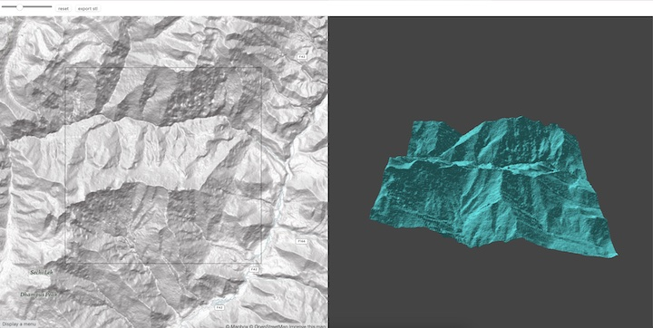

# terrain print

⚠️ Unfinished

A tool for extracting terrain data from a map. Data is extracted as STL.

## Known Issues

- Performance issue when moving the map
- Lighting issue due to wrong vertex normals (the "grid")
- STL scale
